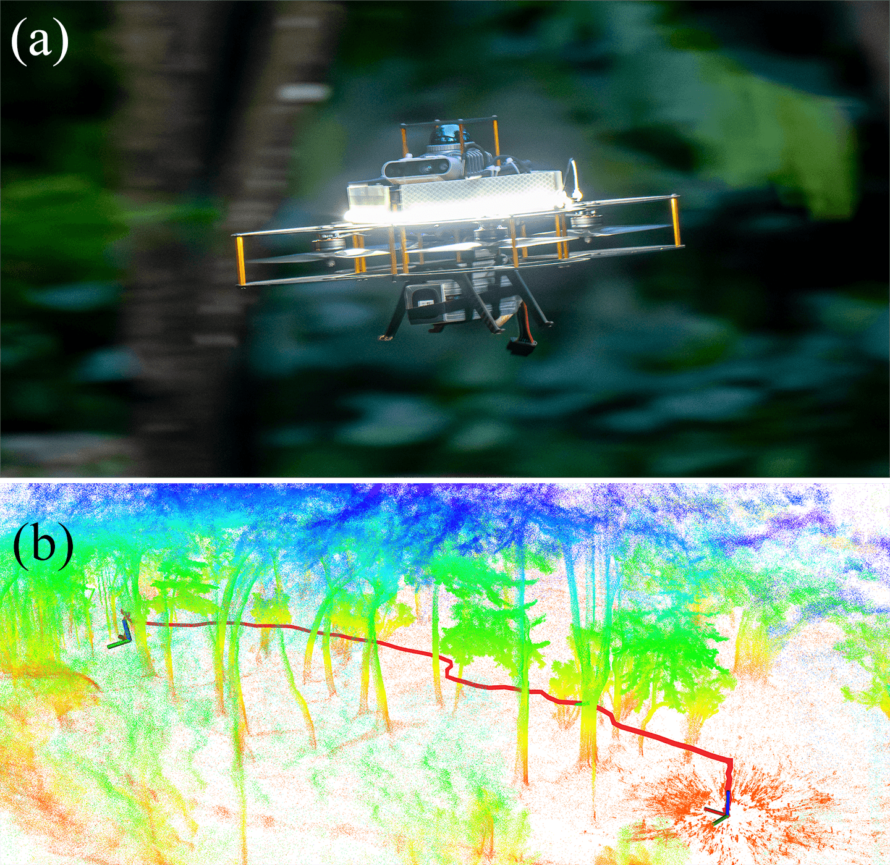

  
  <h1>Agile in the Face of Delay</h1>
  <h2>Asynchronous End-to-End Learning for Real-World Aerial Navigation</h2>

    <strong>Yude Li</strong>1, &dagger;, 
    <strong>Zhexuan Zhou</strong>1, &dagger;, 
    <strong>Huizhe Li</strong>1, 
    <strong>Youmin Gong</strong>1, *,
    <strong>Jie Mei</strong>1, *
  

  

    1School of Intelligence Science and Engineering, Harbin Institute of Technology, Shenzhen, China
  

  
  

    &dagger;Equal contribution
    &nbsp;&nbsp;
    *Co-corresponding authors
  

  

    🎉 Accepted to IEEE ICRA 2026
  

  
  
  
  
  

 

  
  
<em>Figure 1: Zero-shot sim-to-real flight in a dense forest. Our asynchronous policy enables agile navigation even with significant sensor delays.</em>

---

### 🟢 Abstract

Robust autonomous navigation for Autonomous Aerial Vehicles (AAVs) in complex environments is a critical capability. However, modern end-to-end navigation faces a key challenge: the high-frequency control loop needed for agile flight conflicts with low-frequency perception streams. 

To resolve this, we propose an **asynchronous reinforcement learning framework** that decouples perception and control. This enables a high-frequency policy to act on the latest IMU state for immediate reactivity, while incorporating perception features asynchronously. To manage the resulting data staleness, we introduce a theoretically-grounded **Temporal Encoding Module (TEM)**, complemented by a two-stage curriculum that ensures stable and efficient training. 

Validated in extensive simulations, our method was successfully deployed in **zero-shot sim-to-real transfer** on an onboard NUC, where it sustains a **100 Hz control rate** and demonstrates robust, agile navigation in cluttered real-world environments.

---

### 🎥 Method Overview

  
  
<em>Figure 2: The Asynchronous End-to-End Learning Framework.</em>

Our framework addresses the **Age of Information (AoI)** problem caused by the mismatch between fast IMU updates and slow LiDAR perception.

* **Asynchronous Architecture:** Decouples the perception loop (LiDAR processing) from the control loop (Policy Inference).
* **Pseudo-Image Perception:** Converts 3D LiDAR point clouds into a 2D spherical projection (Pseudo-Image) for efficient CNN processing.
* **Temporal Encoding Module (TEM):** Explicitly encodes the time delay ($\Delta t_{lidar}$) into the state vector, allowing the policy to compensate for partial observability caused by data staleness.

---

### 🚀 Experiments & Results

We compared our method against state-of-the-art baselines like **NavRL**, **YOPO**, and **EGO-Planner-v2**.

#### Robustness to Low Sensor Frequency (10 Hz)
Even when perception is limited to 10 Hz, our method maintains a **91.08% success rate**, significantly outperforming synchronous baselines which degrade severely under latency.

| Model | Success Rate (100Hz) | Success Rate (10Hz) | Performance Loss |
| :--- | :---: | :---: | :---: |
| NavRL [16] | 86.96% | 75.37% | 11.6% |
| YOPO [13] | 67.71% | 58.51% | 9.2% |
| **Ours (Async)** | **93.67%** | **91.08%** | **2.6%** |

#### Real-World Deployment
The policy was deployed **zero-shot** on a custom quadrotor with a Livox Mid-360 LiDAR and Intel NUC 13.
* **Indoor Cluttered Field:** Successfully navigated dense obstacles ($0.25 m^{-2}$).
* **Outdoor Forest:** Demonstrated robust flight in unstructured environments ($0.18 m^{-2}$).

---

<h3>📝 Citation</h3>

<pre style="margin: 0;">@article{li2025agile,
  title={Agile in the Face of Delay: Asynchronous End-to-End Learning for Real-World Aerial Navigation},
  author={Li, Yude and Zhou, Zhexuan and Li, Huizhe and Gong, Youmin and Mei, Jie},
  journal={arXiv preprint arXiv:2509.13816},
  year={2025}
}</pre>

